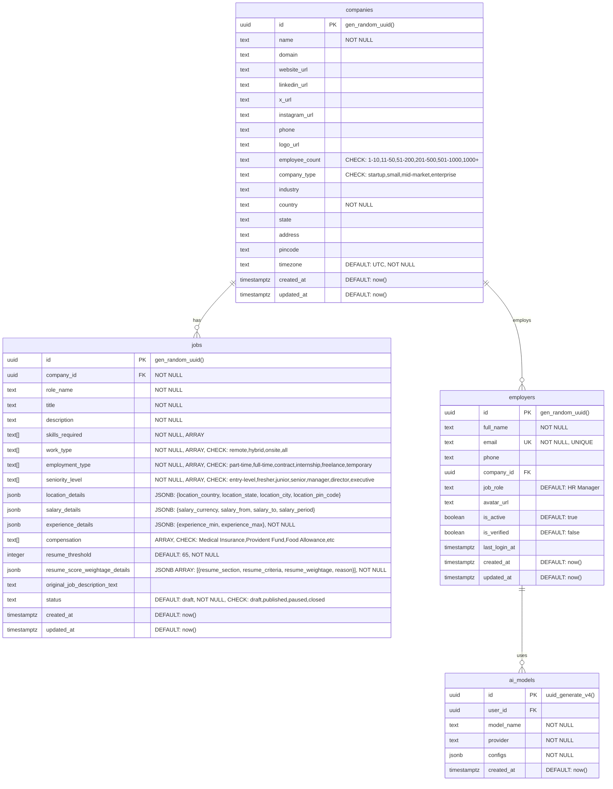

# Database Schema - Upzella P3

## Overview
This document represents the updated database schema of the Upzella P3 system with JSON-based field restructuring. The database consists of 4 main tables with enhanced JSON data structures for better organization.

## Table Details

### Companies Table
- **Purpose**: Stores company information and profile details
- **RLS**: Disabled
- **Size**: 144 kB (53 live rows, 9 dead rows)
- **Primary Key**: `id` (UUID)
- **Constraints**: 
  - `employee_count` must be one of: '1-10', '11-50', '51-200', '201-500', '501-1000', '1000+'
  - `company_type` must be one of: 'startup', 'small', 'mid-market', 'enterprise'
- **Foreign Key Relations**: Referenced by `jobs.company_id` and `employers.company_id`

### Employers Table  
- **Purpose**: Stores employer/user account information
- **RLS**: Disabled
- **Size**: 160 kB (2 live rows, 20 dead rows)
- **Primary Key**: `id` (UUID)
- **Unique Constraints**: `email` must be unique
- **Comments**: `job_role` field represents the employer's position within their company
- **Foreign Key Relations**: 
  - References `companies.id` via `company_id`
  - Referenced by `ai_models.user_id`

### Jobs Table
- **Purpose**: Stores enhanced job postings with JSON-structured data for better organization and flexibility
- **RLS**: Enabled (Row Level Security)
- **Size**: 64 kB (estimated - will grow with new JSON fields)
- **Primary Key**: `id` (UUID)
- **Enhanced JSON Structure Features**: 
  - Consolidated location information in `location_details` JSONB field with country, state, city, pin_code
  - Unified salary information in `salary_details` JSONB field with currency, range, and period
  - Experience requirements in `experience_details` JSONB field with min/max values
  - Resume scoring criteria moved to `resume_score_weightage_details` JSONB array eliminating separate table
  - Updated constraint values for modern work arrangements
- **JSONB Fields**: 
  - `location_details`: `{location_country, location_state, location_city, location_pin_code}`
  - `salary_details`: `{salary_currency: 'USD'|'INR', salary_from, salary_to, salary_period: 'per hour'|'per month'|'per annum'}`
  - `experience_details`: `{experience_min, experience_max}` (NOT NULL)
  - `resume_score_weightage_details`: Array of `{resume_section: 'Education'|'Experience'|'Projects'|'Certifications'|'Skills'|'Achievements', resume_criteria: string, resume_weightage: number, reason: string}` (NOT NULL)
- **Array Fields**: 
  - `skills_required` - Technical and professional skills (text array)
  - `work_type` - Work arrangements (constrained to: remote, hybrid, onsite, all)
  - `employment_type` - Employment types (constrained to: part-time, full-time, contract, internship, freelance, temporary)
  - `seniority_level` - Experience levels (constrained to: entry-level, fresher, junior, senior, manager, director, executive)
  - `compensation` - Standard benefits (Medical Insurance, Provident Fund, Food Allowance, House Allowance, Transport Allowance, Performance Bonus, Gym Membership, Learning Stipend, Flexible Hours, Work From Home, Stock Options)
- **Removed Fields**: 
  - `job_name` - Eliminated in favor of using title field
  - Individual experience fields (`experience_min`, `experience_max`) - Moved to JSON
  - Individual salary fields (`salary_currency`, `salary_from`, `salary_to`, `salary_period`) - Moved to JSON
- **Foreign Key Relations**: 
  - References `companies.id` via `company_id`

### AI Models Table
- **Purpose**: Stores AI model configurations for users
- **RLS**: Enabled (Row Level Security) 
- **Size**: 48 kB (1 live row, 5 dead rows)
- **Primary Key**: `id` (UUID)
- **JSONB Field**: `configs` stores model configuration data
- **Foreign Key Relations**: References `employers.id` via `user_id`

## Security Features

### Row Level Security (RLS)
The following tables have RLS enabled:
- `jobs` - Ensures users can only access jobs from their company
- `ai_models` - Limits AI model access to the owning user

### Data Validation
- Company employee count and type are constrained to specific values
- Email uniqueness is enforced at database level
- All foreign key relationships maintain referential integrity
- JSON schema validation for structured JSONB fields
- Resume scoring weightage validation (must sum to 100)
- GIN indexes on JSONB fields for efficient querying

## Major Schema Changes
- **Removed Tables**: `resume_scoring_weights` table eliminated - data consolidated into jobs table JSON field
- **JSON Consolidation**: Individual columns converted to structured JSONB fields for better data organization
- **Constraint Updates**: Work type and employment type values updated for modern work arrangements
- **Field Elimination**: Redundant `job_name` field removed in favor of `title`
- **Enhanced Validation**: JSON structure allows for more complex validation and data integrity

## Database Statistics
- **Total Tables**: 4 (reduced from 5)
- **Tables with RLS**: 2 (jobs, ai_models)
- **Total Database Size**: ~465 kB (optimized with JSON structure)
- **Active Records**: 66 live rows across all tables
- **PostgreSQL Version**: 17.4.1.068
