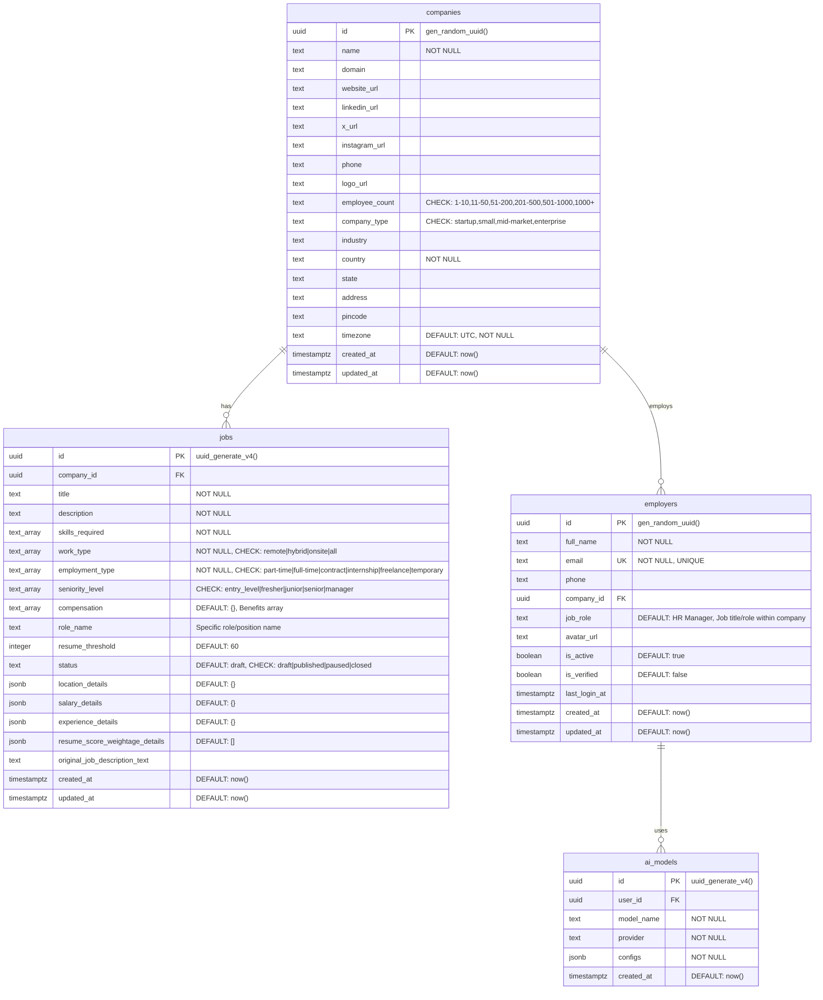

# Database Schema - Upzella P3

## Overview
This document represents the current database schema of the Upzella P3 system with enhanced JSON-based field restructuring and advanced features. The database consists of 4 main tables with sophisticated JSONB data structures for optimal flexibility and performance, running on PostgreSQL 17.4.1.

## Table Details

### Companies Table
- **Purpose**: Stores company information and profile details for organizational management
- **RLS**: Disabled (accessible across organization boundaries)
- **Size**: 144 kB (53 live rows, 9 dead rows)
- **Primary Key**: `id` (UUID, auto-generated)
- **Key Features**:
  - Company profile management with social media links
  - Employee count categorization for analytics
  - Geographic location tracking with timezone support
- **Constraints**: 
  - `employee_count`: '1-10', '11-50', '51-200', '201-500', '501-1000', '1000+'
  - `company_type`: 'startup', 'small', 'mid-market', 'enterprise'
- **Foreign Key Relations**: 
  - Referenced by `jobs.company_id` (one-to-many)
  - Referenced by `employers.company_id` (one-to-many)

### Employers Table  
- **Purpose**: Stores employer/user account information with authentication and profile data
- **RLS**: Disabled
- **Size**: 160 kB (2 live rows, 27 dead rows)
- **Primary Key**: `id` (UUID, auto-generated)
- **Key Features**:
  - User authentication and profile management
  - Avatar upload support with file URL storage
  - Account status and verification tracking
  - Last login timestamp for session management
- **Unique Constraints**: `email` (enforced at database level)
- **Comments**: `job_role` represents the employer's position within their company (e.g., HR Manager, Recruiter, CEO)
- **Foreign Key Relations**: 
  - References `companies.id` via `company_id`
  - Referenced by `ai_models.user_id` (one-to-many)

### Jobs Table
- **Purpose**: Enhanced job postings with JSON-structured data for flexible job management
- **RLS**: Enabled (Row Level Security for company data isolation)
- **Size**: 320 kB (4 live rows, 36 dead rows)
- **Primary Key**: `id` (UUID, auto-generated with uuid_generate_v4())
- **Key Features**:
  - AI-powered job creation with original text preservation
  - Multi-select work arrangements and employment types
  - Flexible compensation and benefits management
  - Resume scoring criteria with weightage system
  - Draft/published workflow with status management

- **Enhanced JSON Structure**: 
  - **`location_details`** (JSONB): `{location_country, location_state, location_city, location_pin_code}`
  - **`salary_details`** (JSONB): `{salary_currency: 'USD'|'INR', salary_from, salary_to, salary_period: 'per hour'|'per month'|'per annum'}`
  - **`experience_details`** (JSONB): `{experience_min, experience_max}`
  - **`resume_score_weightage_details`** (JSONB Array): `[{resume_section: 'Education'|'Experience'|'Projects'|'Certifications'|'Skills'|'Achievements', resume_criteria: string, resume_weightage: number, reason: string}]`

- **Array Fields with Constraints**: 
  - **`skills_required`** - Technical and professional skills (text array, required)
  - **`work_type`** - Work arrangements: remote, hybrid, onsite, all
  - **`employment_type`** - Employment types: part-time, full-time, contract, internship, freelance, temporary
  - **`seniority_level`** - Experience levels: entry_level, fresher, junior, senior, manager
  - **`compensation`** - Benefits: Medical Insurance, Provident Fund, Food Allowance, House Allowance, Transport Allowance, Performance Bonus, Gym Membership, Learning Stipend, Flexible Hours, Work From Home, Stock Options

- **Status Management**: 
  - **`status`** - Job lifecycle: draft, published, paused, closed (default: draft)
  - **`resume_threshold`** - Minimum score for candidate filtering (default: 60)

- **Foreign Key Relations**: 
  - References `companies.id` via `company_id`

### AI Models Table
- **Purpose**: Stores AI model configurations for users with flexible configuration management
- **RLS**: Enabled (Row Level Security for user data isolation)
- **Size**: 48 kB (1 live row, 5 dead rows)
- **Primary Key**: `id` (UUID, auto-generated)
- **Key Features**:
  - Multi-provider AI model support
  - Flexible configuration storage via JSONB
  - User-specific model settings
- **JSONB Field**: `configs` stores provider-specific model configuration data
- **Foreign Key Relations**: References `employers.id` via `user_id`

## Security Features

### Row Level Security (RLS)
Advanced security implemented on sensitive tables:
- **`jobs`** - Company data isolation (users can only access their company's jobs)
- **`ai_models`** - User data isolation (users can only access their own AI configurations)

### Data Validation & Integrity
- **Constraint Validation**: Employee count and company type constraints
- **Email Uniqueness**: Database-level unique constraint on employer emails
- **Foreign Key Integrity**: All relationships maintain referential integrity
- **JSONB Validation**: Schema validation for structured JSON fields
- **Resume Scoring**: Automatic validation that scoring weightage sums to 100%
- **Performance Optimization**: GIN indexes on JSONB fields for efficient querying

### Advanced Database Features
- **UUID Primary Keys**: All tables use UUID for enhanced security and scalability
- **Automatic Timestamps**: Created/updated timestamps with timezone support
- **Soft Delete Support**: Activity tracking without hard deletes
- **JSON Schema Evolution**: JSONB fields allow schema evolution without migrations

## Performance & Statistics

### Current Database Metrics
- **Total Tables**: 4 (optimized architecture)
- **Tables with RLS**: 2 (jobs, ai_models)
- **Total Database Size**: ~680 kB (efficient JSON structure)
- **Active Records**: 60 live rows across all tables
- **PostgreSQL Version**: 17.4.1.068 (latest stable)

### Indexing Strategy
- **Primary Keys**: B-tree indexes on all UUID primary keys
- **Foreign Keys**: Automatic indexes on all foreign key references
- **JSONB Fields**: GIN indexes for efficient JSON querying
- **Unique Constraints**: Unique index on employer emails
- **Text Search**: Full-text search capabilities on job descriptions

### Database Optimization Features
- **Connection Pooling**: Efficient connection management via Supabase
- **Automatic Backups**: Point-in-time recovery with 7-day retention
- **Real-time Subscriptions**: WebSocket support for live updates
- **API Generation**: Automatic REST and GraphQL API generation
- **Edge Caching**: Global edge cache for improved performance

## Migration History
- **Schema Evolution**: Consolidated from 5 to 4 tables with JSON restructuring
- **Field Optimization**: Moved individual salary/experience fields to JSON objects
- **Constraint Updates**: Modern work arrangement and employment type values
- **Performance**: Eliminated separate resume scoring table via JSON arrays
- **Security**: Implemented RLS on sensitive data tables

## API Integration
- **Supabase Client**: Real-time database with automatic API generation
- **JWT Authentication**: Secure token-based access control
- **Row Level Security**: Database-level authorization
- **Real-time Updates**: WebSocket subscriptions for live data
- **File Storage**: Integrated file storage for avatars and documents
