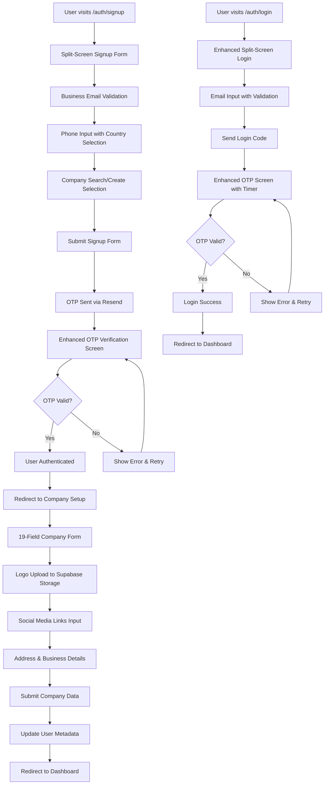
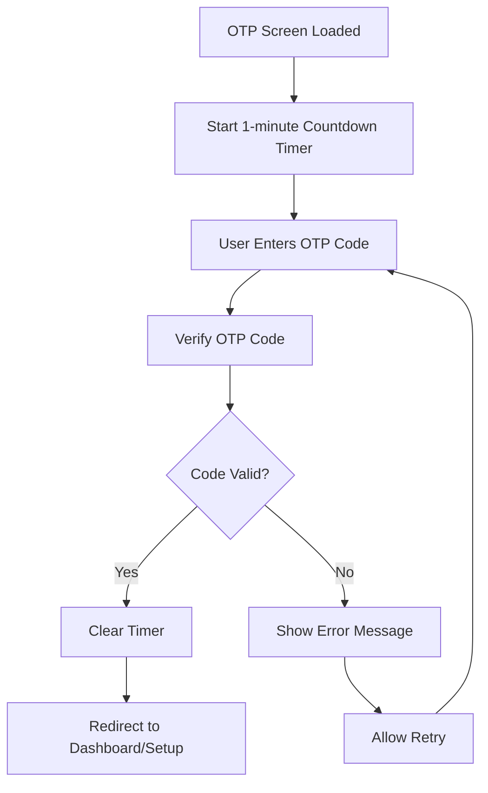
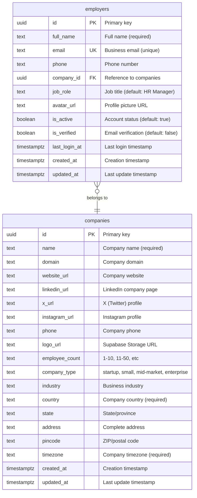

# 📄 **PRD: Phase 1 – Module 1**  
## 🔐 **Employer Authentication & Company Setup**  
**Version**: 5.0  
**Product**: Upzella – AI-Powered HR Assistant Platform  
**Owner**: Upzella Product Team  
**Status**: Enhanced Implementation with Complete Company Onboarding  
**Target Release**: MVP Launch – Sprint 1  
**Email Service**: ✅ **Resend**  
**Database**: ✅ **Supabase PostgreSQL**  
**File Storage**: ✅ **Supabase Storage** (for company logos)  
**Security**: ✅ Row Level Security (RLS) Enabled  

---

## 🎯 **Overview**

This module is the **foundation of Upzella**, enabling HR professionals and founders to securely sign up, verify identity via OTP, and complete comprehensive company onboarding with logo upload and social media integration.

**Enhanced Flow:**
- **Signup & Authentication**: Employer enters name, business email, phone, job title with modern split-screen design
- **OTP Verification**: 6-digit OTP sent via **Resend** with timer display and enhanced UX
- **Company Setup**: Complete company profile with all 19 database fields using Upzella Design System
- **Logo Upload**: Company logo storage via **Supabase Storage** with RLS policies
- **Social Media**: LinkedIn, X (Twitter), Instagram profile links integration
- **User Metadata**: Company association stored in user profile for fast access

> ✅ **No passwords required**  
> ✅ **Modern split-screen design matching signup UX**  
> ✅ **Comprehensive company onboarding**  
> ✅ **Logo upload with secure storage**  
> ✅ **Auto-fill company name from signup**  
> ✅ **All 19 company fields supported**  
> ✅ **User metadata integration**

---

## 🧩 **Sub-Modules**

| Sub-Module | Purpose | Status |
|-----------|---------|---------|
| 2.1 Enhanced Signup | Split-screen design with business email validation | ✅ Implemented |
| 2.2 Enhanced Login | Matching split-screen UX with improved OTP flow | ✅ Updated |
| 2.3 OTP Verification | Post-auth: verify via 6-digit code with enhanced timer | ✅ Enhanced |
| 2.4 Company Setup | All 19 database fields with Upzella components | ✅ Complete |
| 2.5 Logo Upload | Company logo upload to Supabase Storage | ✅ Implemented |
| 2.6 User Metadata | Company_id association in user profile | ✅ Active |

---

## 🔁 **Authentication & Company Setup Flow**



---

## 🔁 **OTP Verification Flow**



---

## 📁 **Key File Structure**

```
src/
├── app/
│   ├── auth/
│   │   ├── login/page.tsx          # Enhanced split-screen login
│   │   └── signup/page.tsx         # Enhanced split-screen signup
│   └── onboarding/
│       └── company-setup/page.tsx  # 19-field company setup
├── components/
│   ├── ui-components/              # Upzella Design System
│   │   ├── Input.tsx
│   │   ├── Button.tsx
│   │   ├── Select.tsx
│   │   └── form/
│   └── svg-icons/                  # Icon system
├── lib/schema/
│   ├── company.schema.ts           # Company data validation
│   └── employer.schema.ts          # Employer data validation
├── context/
│   └── AuthContext.tsx             # Authentication state management
└── services/
    ├── auth.service.ts             # Authentication logic
    └── companies.service.ts        # Company CRUD operations
```

---

## 🗃️ **Database Schema (Supabase PostgreSQL)**

### **Companies Table (19 Fields)**


### **Supabase Auth Integration**
```typescript
// User metadata structure (auth.users table)
{
  "company_id": "uuid-reference-to-companies-table",
  "onboarding_completed": true,
  "email_verified": true
}
```

---

## 🔐 **Security & Storage**

### **Row Level Security (RLS) Policies**
- ✅ Company data access restricted by employer association
- ✅ Employer profile access restricted to own data
- ✅ Storage bucket policies for logo uploads
- ✅ Business email domain validation at database level

### **Supabase Storage Configuration**
- **Bucket**: `company` (public bucket for logos)
- **File Types**: JPG, PNG, GIF, WebP
- **Size Limit**: 5MB per file
- **Policies**: Authenticated upload, public read access

---

## 🎨 **Design System Integration**

All components use the **Upzella Design System** with:
- **Modern Split-Screen Layout**: Hero section with animated graphics
- **Typography**: Montserrat (headings), Inter (body), Poppins (UI)
- **Color Palette**: Blue primary, purple secondary, pink accents
- **Components**: Form, Input, Button, Select, Textarea from design system
- **Responsive**: Mobile-first design with desktop enhancements

---

## 🧪 **Testing Scenarios**

| Test Case | Action | Expected Result |
|-----------|--------|-----------------|
| 1. Signup Flow | Complete signup with business email | OTP sent, account created |
| 2. Login Flow | Enter email, verify OTP | Authenticated, redirected |
| 3. Company Setup | Fill all 19 fields, upload logo | Company created, user associated |
| 4. Email Validation | Try consumer email (gmail.com) | Validation error shown |
| 5. Logo Upload | Upload 5MB+ image | Size validation error |
| 6. Form Validation | Submit incomplete form | Field-specific errors shown |
| 7. Resend OTP | Click "Resend" after 60s | New code sent, old invalidated |
| 8. RLS Check | Try to access another company's data | Access denied (403) |

---

This enhanced PRD reflects the current implementation with modern split-screen design, comprehensive company onboarding, and secure file storage integration.
