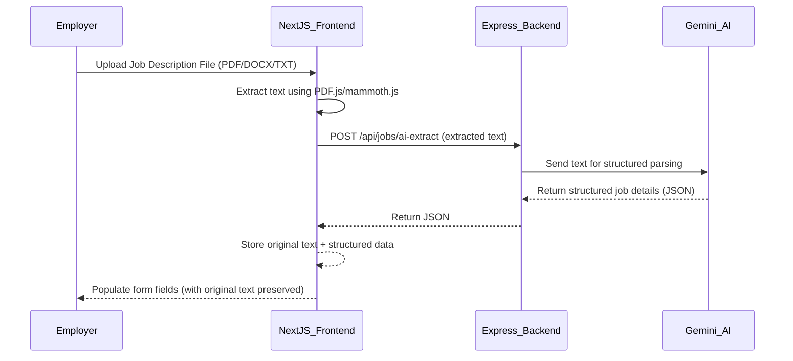
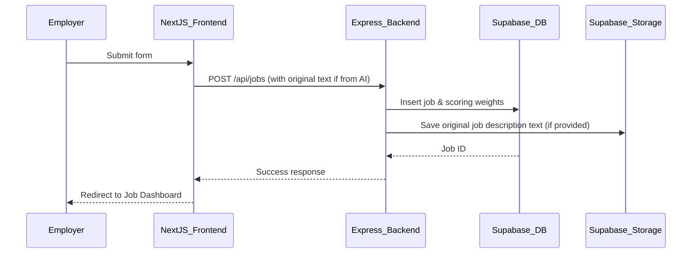

Alright — I’ll give you the **full PRD for Phase 1 – Module 2 – Submodule 2** with **Next.js implementation**, including:

* All requirements (functional + non-functional)
* Page flows and component structure
* Detailed API interaction mapping
* UI wireframe diagrams
* Sequence diagrams for AI auto-fill and job save flows
* Validation rules
* Testing plan
* Security considerations

This will make it **end-to-end dev ready** so your frontend team can build it without ambiguity.

---

# 📄 **PRD: Phase 1 – Module 2 – Submodule 2**

**Frontend (Next.js 15 – Employer Portal)**

---

## 1️⃣ **Module Overview**

**Goal:**
Implement the **Job Creation UI** for employers, allowing them to manually enter job details or use AI to auto-fill from a job description file. On save, the job should be persisted in the backend (Express.js + Supabase) and the user redirected to the **Job Dashboard**.

---

## 2️⃣ **Functional Requirements**

### 2.1 Job Creation

* Employer can create a new job with the following fields:

  1. **Job Title** (text, required)
  2. **Job Description** (rich text or textarea, required)
  3. **Skills Required** (multi-tag input, required)
  4. **Work Type** (multi-select dropdown: Full-time, Part-time, Hybrid, Remote, Contract, Internship)
  5. **Employment Type** (single-select dropdown: Permanent, Temporary, Internship, Contractor)
  6. **Experience Range** (dual range slider: min 0, max 20 years)
  7. **Resume Threshold (%)** (number input, default 60)
  8. **Resume Scoring Weightage Table**:

     * Section Name (text)
     * Criteria Description (text)
     * Weightage (%) — must sum to 100

---

### 2.2 AI Auto-Fill from Job Description

* Employer can upload a `.pdf`, `.docx`, or `.txt` file
* **Frontend text extraction:** Files are processed in the browser using PDF.js and mammoth.js
* Extracted text is sent to backend AI service for structured extraction
* **Original text preservation:** The original extracted text is stored and passed to backend when creating the job
* Returned fields populate the form automatically (editable after)

---

### 2.3 Save Job

* On save:

  * Validate form
  * Validate resume scoring weightage sum = 100%
  * POST data to `/api/jobs` (Express backend)
  * **Include original text:** If job was created from AI extraction, include `original_job_description_text` in request
  * **Backend storage:** Original job description text is automatically saved to Supabase Storage for backup
* On success: redirect to `/jobs/[jobId]/dashboard`

---

### 2.4 Job Dashboard (Basic for now)

* Displays:

  * Job Title & Description
  * Skills Required
  * Resume Threshold
  * Resume Scoring Table
* **Sync Candidates** button:

  * Opens modal to select CRM (HubSpot clickable)
  * Future: connect to HubSpot sync API

---

## 3️⃣ **Non-Functional Requirements**

* Must follow **existing Next.js 15 + Tailwind + shadcn/ui** code style from employer app
* Use **React Query** for data fetching/mutations
* Form validation with `react-hook-form` + `yup`
* **Client-side file processing:** Use PDF.js and mammoth.js for text extraction in browser
* Show toasts for success/error
* Mobile responsive
* **File handling:** Support PDF, DOCX, and TXT files up to 10MB
* **Progressive enhancement:** Graceful degradation if file processing fails

---

## 4️⃣ **Page & Component Structure**

```
app/
  jobs/
    create/
      page.tsx           # Job creation page
      JobForm.tsx        # Full form UI
      JobAiFill.tsx      # AI auto-fill upload
    [jobId]/
      dashboard/
        page.tsx         # Job dashboard
components/
  forms/
    MultiSelect.tsx
    RangeSlider.tsx
    TagsInput.tsx
    DynamicTable.tsx
lib/
  api/
    jobs.ts              # Axios API calls
```

---

## 5️⃣ **Frontend → Backend API Mapping**

| Action          | Endpoint               | Method |
| --------------- | ---------------------- | ------ |
| Save Job        | `/api/jobs`            | POST   |
| AI Auto-fill    | `/api/jobs/ai-extract` | POST   |
| Get Job Details | `/api/jobs/:jobId`     | GET    |

---

## 6️⃣ **Sequence Diagram – AI Auto-fill Flow**



---

## 7️⃣ **Sequence Diagram – Save Job Flow**



---

## 8️⃣ **Validation Rules**

* Required fields: title, description, skills, work type, employment type, experience range
* Resume scoring weightage sum must = 100%
* Resume threshold between 0–100
* Experience min ≤ max
* File upload only accepts `.pdf`, `.docx`, `.txt`

---

## 9️⃣ **Testing Plan**

| Test Case | Action                       | Expected Result                  |
| --------- | ---------------------------- | -------------------------------- |
| 1         | Fill form manually & save    | Job saved, redirect to dashboard |
| 2         | AI autofill valid text       | Fields populated correctly       |
| 3         | Weightage sum ≠ 100          | Validation error                 |
| 4         | Upload invalid file to AI    | Error toast                      |
| 5         | Save missing required fields | Validation error                 |
| 6         | AI job creation with storage | Job created, original text saved |
| 7         | Large file upload (>10MB)    | Error handling                   |
| 8         | Corrupted file upload        | Graceful error handling          |

---

## 🔟 **Security**

* Get JWT token from Supabase Auth
* Pass `Authorization: Bearer <token>` in API calls
* Ensure backend RLS filters jobs by `company_id`

